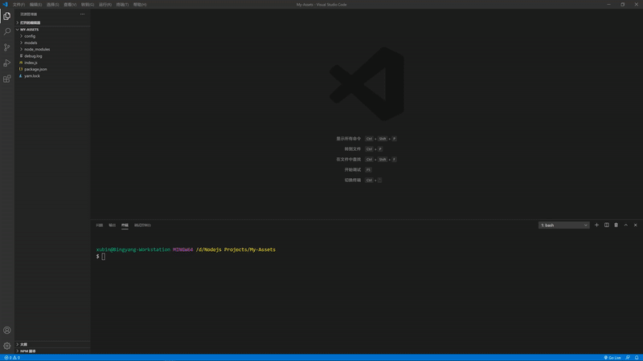

# 一个简单的获取银行存款信息的自动化工具

### 简单介绍
* 目前写了基于我自己在使用的```三菱UFJ银行```，```野村证券```和```乐天信用卡```。其他银行可以自行举一反三。授人以渔嘛。
* 浏览器是用的```Chrome```. 可以替换为```webdriverJS```支持的```Firefox, Safari, Edge, Internet Explorer```.
* 如果网速慢的话，建议调整等待时常。默认为```2000毫秒```。
* 银行鉴权信息统统在环境信息里填写，遵守安全第一原则，请自行更改。代码里提供了环境配置文件模板。

### 关于用到的技术
1. [selenium-webdriver](https://www.selenium.dev/selenium/docs/api/javascript/) - 自动化框架来实现自动填充，自动跳转，和抓取数据。
2. [Google Chrome](https://www.google.com/intl/zh-CN/chrome/) - 浏览器提供页面渲染和数据展示。
3. [MongoDB Atlas](https://www.mongodb.com/cloud/atlas) - 云化的MongoDB数据库服务，有免费版。
4. [Node.js](https://nodejs.org/zh-cn/download/) - 一个热门的JavaScript运行时。

### 效果预览



### 使用说明
###### 1. [Node.js下载](https://nodejs.org/zh-cn/download/)
###### 2. 获取MongoDB的连接URI. 推荐用[MongoDB Altas](https://www.mongodb.com/cloud/atlas).
###### 2. 查询浏览器版本（以Chrome为例子）

###### 3. 根据浏览器版本，在[webdriverJS官网](https://www.selenium.dev/selenium/docs/api/javascript/)匹配下载相应驱动。
###### 4. 把webdriver的存放路径配置到PATH里。
###### 5. ```git clone https://github.com/xubingyang/myAssets.git```
###### 6. ```cd myAssets```进入项目文件夹
###### 7. ```yarn```或者```npm install```(Yarn需要单独安装)
###### 8. 添加自己的银行信息到```config/config-temp.env```后，改名为```config.env```（删除-temp）
###### 9. ```yarn run start```或者```npm run start```

### 不确定的更新计划
* 添加更多银行和机构。
  * <del>乐天信用卡</del>
  * Amex 信用卡
  * Mizuho银行
  * 三井住友银行
* 用Echarts画一些漂亮的图，方便数据展示。
* Windows, Mac, Linux上自动任务化，方便用于VPS，Cloud Instance等虚拟机运行。

### 版本更新说明
* 1.0.0 - 2020/08/30
   * 惊雷一声，应用上线。
* 1.0.1 - 2020/08/31
   * 增加了乐天信用卡的支持。
   * 增加了负债和积分项。
   * 优化部分代码。
   * 优化数据模型，更方便后期数据分析的处理。